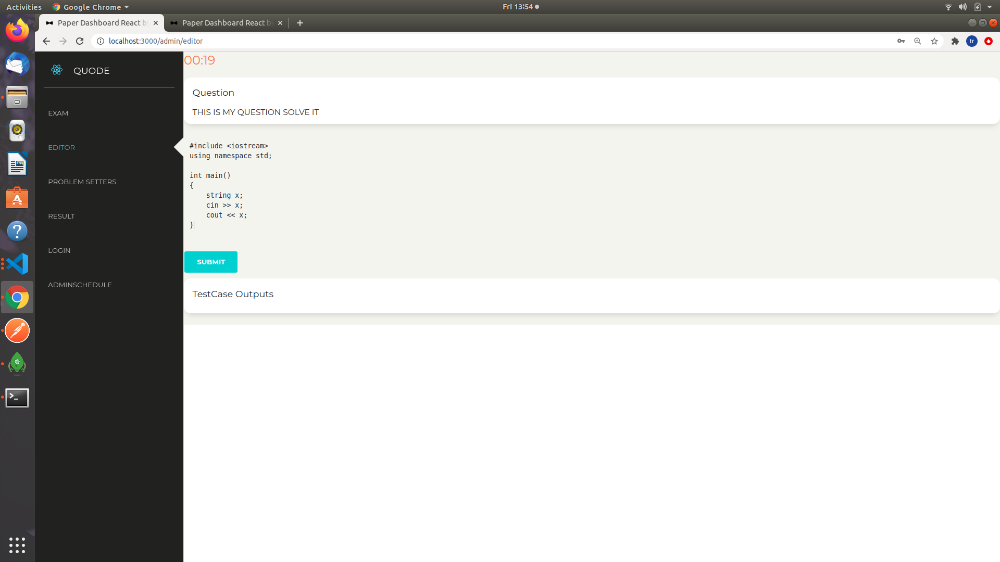
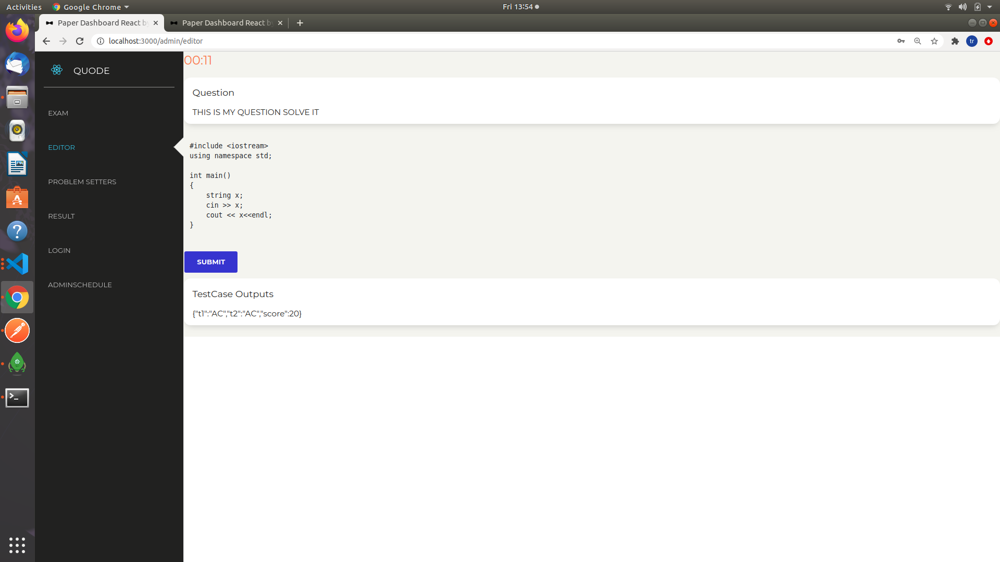
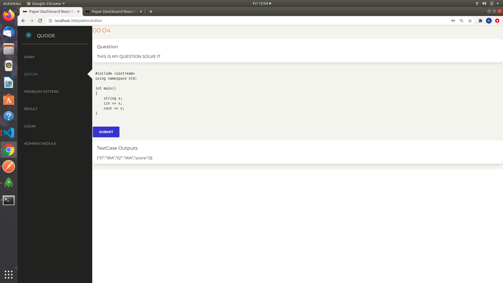
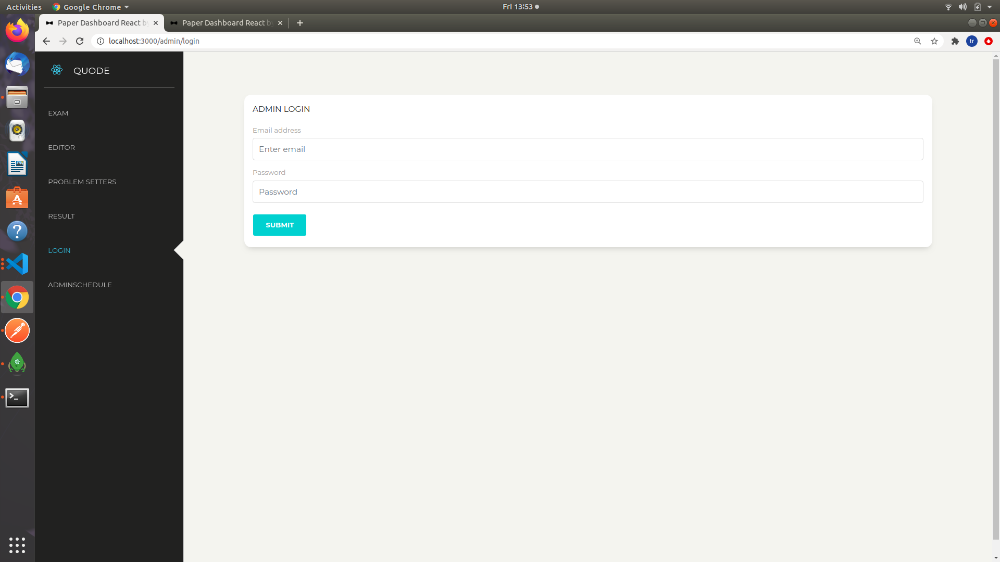
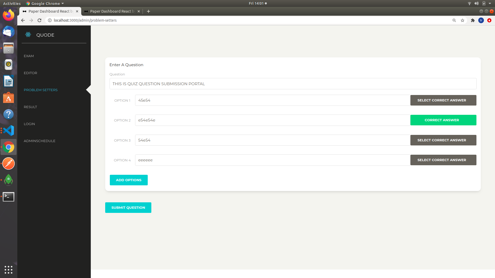
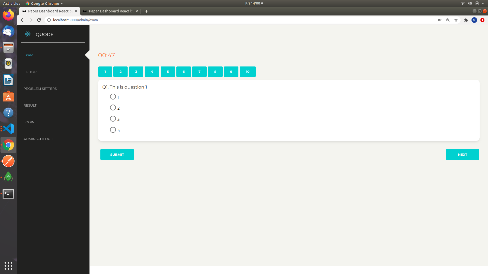
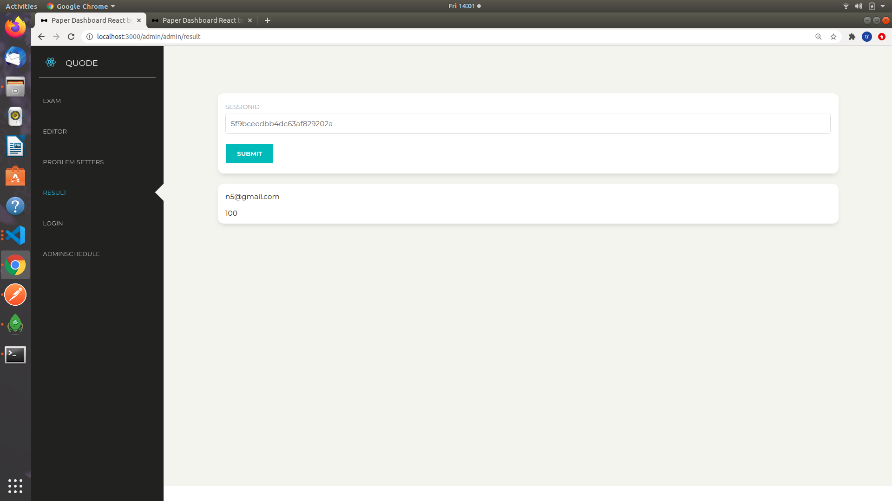

# QUODE

## TECH STACK:- React.JS,Node.JS,ReactStrap(Creative Tim),MongoDB,Express.JS

###### An App for coding Tests and Quiz Tests
 
The Quiz portal has implementation of Quiz app and admin Question Submission  

The coding portal consists of implementation of minimal sandbox using Seccomp and Python Resources Library. 
The code is checked for any compile errors and when executing the same code is checked for time limit constraints and memory constraints. 
Right now implementation supports only CPP for coding terminal. 

## How to use
Quiz Portal can be run directly with minimal configuration. 
In coding portal proper paths need to be defined for Question Locations in local storage. 
Configurations need to be done in test.py and userCodes route. 
The location of coding questions is to be in root of the server in questions directory. 

## Features
Initially admin can send excel file with selection whether to conduct coding test or Quiz test.  
Then users can login and solve the test. 
Questions can be submitted through Question Submission Hub by only admin.  
Results can be viewed through Result hub by entering sessionID which is provided when a user logins. 
## Screenshots

